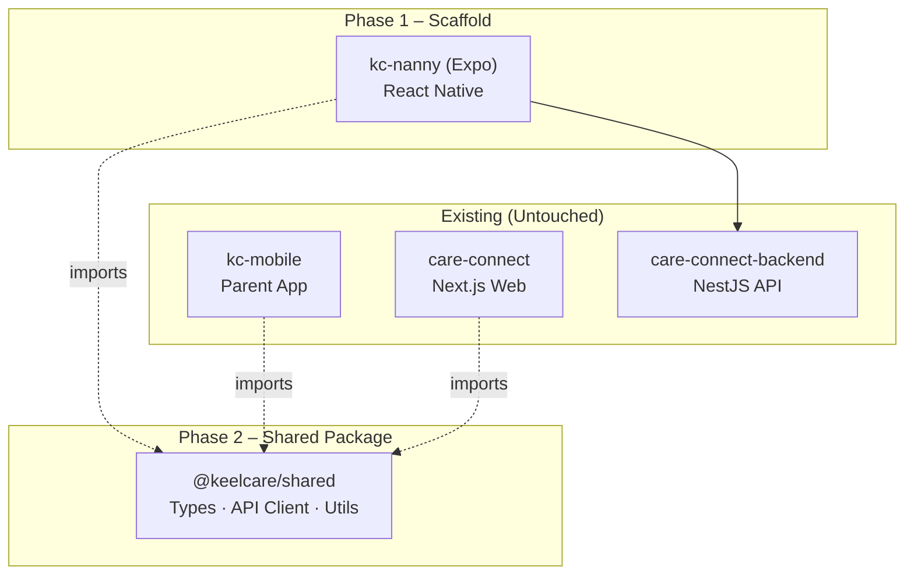
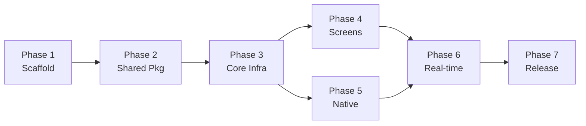
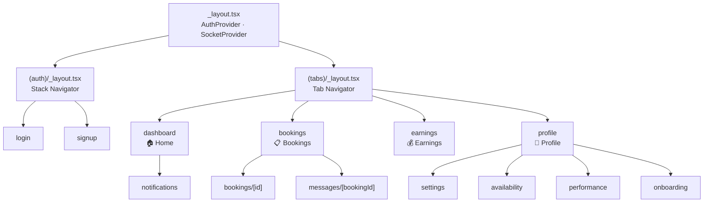
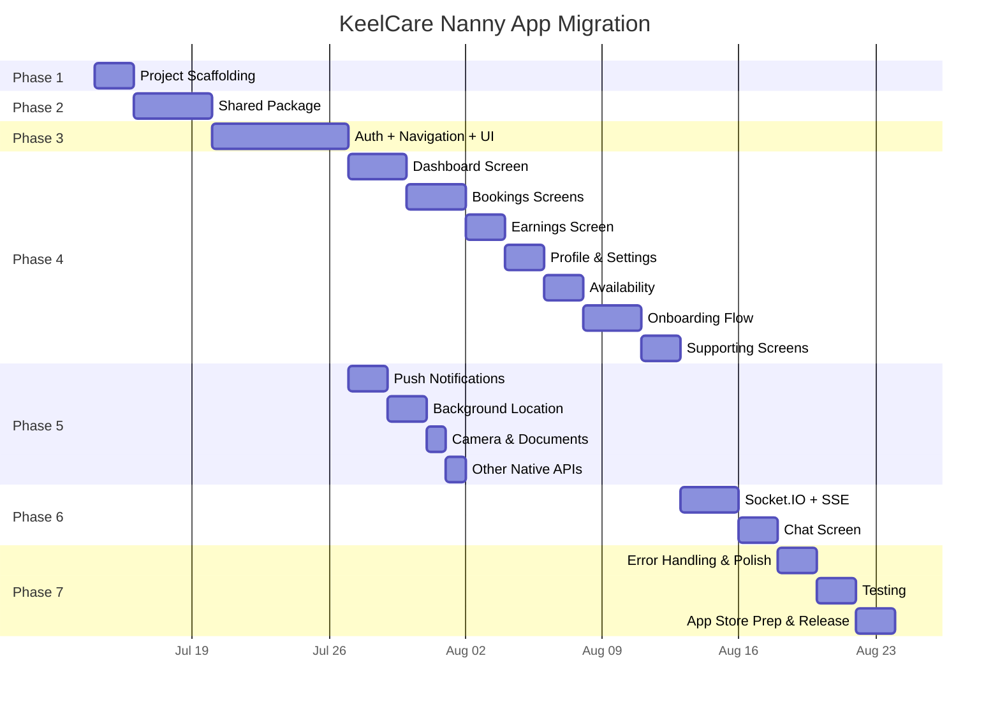

# KeelCare Nanny App — Expo Migration Roadmap

> **Goal**: Migrate all nanny-facing functionality into a standalone React Native Expo app (`kc-nanny`), completely decoupled from the parent app, with zero regression to existing `care-connect` web or `kc-mobile` parent app.

---

## Architecture Overview



---

## Phase Dependency Graph



---

## Complete File Inventory — What Must Be Migrated

Before diving into phases, here's every nanny-relevant file across the three repos, categorised by what happens to it:

### Source: `care-connect` (Next.js Web)

| Category | File | Size | Migration Action |
|---|---|---|---|
| **Nanny Dashboard** | [page.tsx](file:///Users/zenith/Keel/care-connect/src/app/dashboard/page.tsx) | 23.6 KB | Rewrite as RN screen |
| **Dashboard Layout** | [layout.tsx](file:///Users/zenith/Keel/care-connect/src/app/dashboard/layout.tsx) | 17.8 KB | Rewrite as tab/drawer nav |
| **Availability** | [availability/page.tsx](file:///Users/zenith/Keel/care-connect/src/app/dashboard/availability/page.tsx) | 37.2 KB | Rewrite as RN screen |
| **Bookings List** | [bookings/page.tsx](file:///Users/zenith/Keel/care-connect/src/app/dashboard/bookings/page.tsx) | 16.8 KB | Rewrite as RN screen |
| **Booking Detail** | [bookings/[id]/](file:///Users/zenith/Keel/care-connect/src/app/dashboard/bookings/%5Bid%5D) | — | Rewrite as RN screen |
| **Earnings** | [earnings/page.tsx](file:///Users/zenith/Keel/care-connect/src/app/dashboard/earnings/page.tsx) | 12.0 KB | Rewrite as RN screen |
| **Messages** | [messages/[bookingId]/](file:///Users/zenith/Keel/care-connect/src/app/dashboard/messages/%5BbookingId%5D) | — | Rewrite as RN screen |
| **Notifications** | [notifications/page.tsx](file:///Users/zenith/Keel/care-connect/src/app/dashboard/notifications/page.tsx) | 5.1 KB | Rewrite as RN screen |
| **Performance** | [performance/page.tsx](file:///Users/zenith/Keel/care-connect/src/app/dashboard/performance/page.tsx) | 12.6 KB | Rewrite as RN screen |
| **Profile** | [profile/page.tsx](file:///Users/zenith/Keel/care-connect/src/app/dashboard/profile/page.tsx) | 10.5 KB | Rewrite as RN screen |
| **Requests** | [requests/](file:///Users/zenith/Keel/care-connect/src/app/dashboard/requests) | — | Rewrite as RN screen |
| **Settings** | [settings/page.tsx](file:///Users/zenith/Keel/care-connect/src/app/dashboard/settings/page.tsx) | 13.6 KB | Rewrite as RN screen |
| **Onboarding** | [nanny/onboarding/page.tsx](file:///Users/zenith/Keel/care-connect/src/app/nanny/onboarding/page.tsx) | 15.5 KB | Rewrite as RN multi-step |
| **Reviews** | [nanny/reviews/page.tsx](file:///Users/zenith/Keel/care-connect/src/app/nanny/reviews/page.tsx) | 4.8 KB | Rewrite as RN screen |
| **API Client** | [lib/api.ts](file:///Users/zenith/Keel/care-connect/src/lib/api.ts) | 30.5 KB | Extract nanny-relevant methods to shared pkg |
| **API Types** | [types/api.ts](file:///Users/zenith/Keel/care-connect/src/types/api.ts) | 26.5 KB | Extract to shared pkg |
| **Nanny Form Types** | [types/nannyProfileForm.ts](file:///Users/zenith/Keel/care-connect/src/types/nannyProfileForm.ts) | 4.2 KB | Extract to shared pkg |
| **Auth Context** | [context/AuthContext.tsx](file:///Users/zenith/Keel/care-connect/src/context/AuthContext.tsx) | 5.2 KB | Rewrite for RN (no Next.js router) |
| **Socket Provider** | [context/SocketProvider.tsx](file:///Users/zenith/Keel/care-connect/src/context/SocketProvider.tsx) | 6.8 KB | Rewrite for RN |
| **SSE Provider** | [context/SSEProvider.tsx](file:///Users/zenith/Keel/care-connect/src/context/SSEProvider.tsx) | 8.4 KB | Rewrite for RN (no native EventSource) |
| **Notification Context** | [context/NotificationContext.tsx](file:///Users/zenith/Keel/care-connect/src/context/NotificationContext.tsx) | 5.7 KB | Rewrite for RN |

### Source: `care-connect` Components (Nanny-Specific)

| Component | File | Size |
|---|---|---|
| NannyNextBookingCard | [dashboard/nanny/NannyNextBookingCard.tsx](file:///Users/zenith/Keel/care-connect/src/components/dashboard/nanny/NannyNextBookingCard.tsx) | 4.7 KB |
| NannyVerificationBanner | [onboarding/NannyVerificationBanner.tsx](file:///Users/zenith/Keel/care-connect/src/components/onboarding/NannyVerificationBanner.tsx) | 2.4 KB |
| CategoryRequestModal | [nanny/CategoryRequestModal.tsx](file:///Users/zenith/Keel/care-connect/src/components/nanny/CategoryRequestModal.tsx) | 6.3 KB |
| NannyBookingCard | [bookings/NannyBookingCard.tsx](file:///Users/zenith/Keel/care-connect/src/components/bookings/NannyBookingCard.tsx) | 3.8 KB |
| BookingActionsMenu | [bookings/BookingActionsMenu.tsx](file:///Users/zenith/Keel/care-connect/src/components/bookings/BookingActionsMenu.tsx) | 2.0 KB |
| BookingHelpModal | [bookings/BookingHelpModal.tsx](file:///Users/zenith/Keel/care-connect/src/components/bookings/BookingHelpModal.tsx) | 8.5 KB |
| RescheduleModal | [bookings/RescheduleModal.tsx](file:///Users/zenith/Keel/care-connect/src/components/bookings/RescheduleModal.tsx) | 19.5 KB |
| GeofenceAlertBanner | [location/GeofenceAlertBanner.tsx](file:///Users/zenith/Keel/care-connect/src/components/location/GeofenceAlertBanner.tsx) | 8.1 KB |
| ReviewModal | [reviews/ReviewModal.tsx](file:///Users/zenith/Keel/care-connect/src/components/reviews/ReviewModal.tsx) | 5.6 KB |
| DaySelector | [scheduling/DaySelector.tsx](file:///Users/zenith/Keel/care-connect/src/components/scheduling/DaySelector.tsx) | 3.8 KB |
| PersonalInfoSection | [nanny-profile/PersonalInfoSection.tsx](file:///Users/zenith/Keel/care-connect/src/components/nanny-profile/PersonalInfoSection.tsx) | 6.1 KB |
| EducationExperienceSection | [nanny-profile/EducationExperienceSection.tsx](file:///Users/zenith/Keel/care-connect/src/components/nanny-profile/EducationExperienceSection.tsx) | 2.6 KB |
| SkillsInterestsSection | [nanny-profile/SkillsInterestsSection.tsx](file:///Users/zenith/Keel/care-connect/src/components/nanny-profile/SkillsInterestsSection.tsx) | 1.4 KB |
| CompensationSection | [nanny-profile/CompensationSection.tsx](file:///Users/zenith/Keel/care-connect/src/components/nanny-profile/CompensationSection.tsx) | 1.1 KB |
| ConsentsSection | [nanny-profile/ConsentsSection.tsx](file:///Users/zenith/Keel/care-connect/src/components/nanny-profile/ConsentsSection.tsx) | 3.8 KB |
| DocumentsSection | [nanny-profile/DocumentsSection.tsx](file:///Users/zenith/Keel/care-connect/src/components/nanny-profile/DocumentsSection.tsx) | 6.3 KB |

### Source: `kc-mobile` (Already Has Some Nanny Code)

| File | Size | Action |
|---|---|---|
| [pages/dashboard/Dashboard.tsx](file:///Users/zenith/Keel/kc-mobile/src/pages/dashboard/Dashboard.tsx) | 6.0 KB | Reference as migration template |
| [components/dashboard/nanny/NannyHero.tsx](file:///Users/zenith/Keel/kc-mobile/src/components/dashboard/nanny/NannyHero.tsx) | 0.6 KB | Port to Expo (RN compatible) |
| [components/dashboard/nanny/NextUpSession.tsx](file:///Users/zenith/Keel/kc-mobile/src/components/dashboard/nanny/NextUpSession.tsx) | 5.1 KB | Port to Expo |
| [components/dashboard/nanny/QuickActions.tsx](file:///Users/zenith/Keel/kc-mobile/src/components/dashboard/nanny/QuickActions.tsx) | 0.7 KB | Port to Expo |
| [components/dashboard/nanny/RecentFeedback.tsx](file:///Users/zenith/Keel/kc-mobile/src/components/dashboard/nanny/RecentFeedback.tsx) | 3.0 KB | Port to Expo |
| [components/nanny/CategoryRequestModal.tsx](file:///Users/zenith/Keel/kc-mobile/src/components/nanny/CategoryRequestModal.tsx) | 6.2 KB | Port to Expo |

### Shared Hooks (to be extracted)

| Hook | File | Size | Notes |
|---|---|---|---|
| useBookingChat | [hooks/useBookingChat.ts](file:///Users/zenith/Keel/care-connect/src/hooks/useBookingChat.ts) | 5.5 KB | Used by nanny messages screen |
| useLiveSession | [hooks/useLiveSession.ts](file:///Users/zenith/Keel/care-connect/src/hooks/useLiveSession.ts) | 6.1 KB | Background location tracking |
| usePreferences | [hooks/usePreferences.ts](file:///Users/zenith/Keel/care-connect/src/hooks/usePreferences.ts) | 2.5 KB | Settings persistence |
| usePushNotifications | [hooks/usePushNotifications.ts](file:///Users/zenith/Keel/care-connect/src/hooks/usePushNotifications.ts) | 1.7 KB | Capacitor-specific, needs Expo rewrite |

---

## Phase 1 — Project Scaffolding & Dev Environment

**Duration**: 1–2 days  
**Prerequisite**: None  
**Risk**: Low

### Scope
Set up the Expo project with the correct configuration, dev tooling, and CI.

### Tasks
1. Create Expo project: `npx create-expo-app kc-nanny --template blank-typescript`
2. Set up project structure:
   ```
   kc-nanny/
   ├── app/               # Expo Router file-based routing
   │   ├── (auth)/        # Auth screens (login, signup)
   │   ├── (tabs)/        # Main tab navigator
   │   │   ├── dashboard/
   │   │   ├── bookings/
   │   │   ├── earnings/
   │   │   └── profile/
   │   └── _layout.tsx
   ├── components/        # RN components
   ├── context/           # Auth, Socket, Notification providers
   ├── hooks/             # Custom hooks
   ├── lib/               # API client, utils
   ├── types/             # TypeScript definitions
   ├── assets/            # Images, fonts
   └── constants/         # Colors, config
   ```
3. Configure `app.json` / `app.config.ts`:
   - `scheme: "keelcarepartner"` (deep linking)
   - Bundle identifiers: `com.keelcare.partner` (iOS), `com.keelcare.partner` (Android)
   - App name: "KeelCare Partner"
4. Install core dependencies:
   - `expo-router`, `expo-secure-store`, `expo-constants`
   - `react-native-reanimated`, `react-native-gesture-handler`
   - `expo-font` (for custom typography)
5. Set up ESLint, Prettier (mirror existing configs)
6. Set up `.env` handling with `expo-constants`
7. Verify dev build runs on iOS simulator and Android emulator

### Deliverables
- [ ] Expo project bootstrapped and compiling
- [ ] Folder structure matches spec above
- [ ] `app.config.ts` configured with correct bundle IDs
- [ ] Dev build runs on both platforms
- [ ] README with setup instructions

### Acceptance Criteria
- `npx expo start` launches metro bundler
- App shows a placeholder screen on both iOS and Android
- No impact to `care-connect` or `kc-mobile` repos

---

## Phase 2 — Shared Package Extraction (`@keelcare/shared`)

**Duration**: 3–4 days  
**Prerequisite**: Phase 1  
**Risk**: Medium (touches shared code)

### Scope
Extract types, API client methods, and utilities that are common between parent and nanny apps into a standalone package.

### Tasks

#### 2.1 — Create Package Structure
```
packages/
└── shared/
    ├── package.json       # name: @keelcare/shared
    ├── tsconfig.json
    ├── src/
    │   ├── types/
    │   │   ├── api.ts       # All shared interfaces
    │   │   ├── notification.ts
    │   │   └── nannyProfileForm.ts
    │   ├── api/
    │   │   ├── client.ts    # fetchApi core (platform-agnostic)
    │   │   ├── endpoints.ts # Endpoint methods (auth, bookings, etc.)
    │   │   └── index.ts
    │   ├── utils/
    │   │   ├── date.ts
    │   │   ├── format.ts
    │   │   └── crypto.ts
    │   └── index.ts         # Barrel export
    └── dist/                # Compiled output
```

#### 2.2 — Extract Types
Copy and consolidate from:
- [care-connect/src/types/api.ts](file:///Users/zenith/Keel/care-connect/src/types/api.ts) (1138 lines — **all** interfaces)
- [care-connect/src/types/nannyProfileForm.ts](file:///Users/zenith/Keel/care-connect/src/types/nannyProfileForm.ts)
- [care-connect/src/types/notification.ts](file:///Users/zenith/Keel/care-connect/src/types/notification.ts)

#### 2.3 — Extract API Client
The core `fetchApi` function in [api.ts](file:///Users/zenith/Keel/care-connect/src/lib/api.ts) is mostly platform-agnostic (uses native `fetch`). Extract it with a **platform adapter pattern**:

```typescript
// packages/shared/src/api/client.ts
interface PlatformAdapter {
  getBaseUrl(): string;
  getAuthHeaders(): Promise<Record<string, string>>;
  onUnauthorized(): void;
}

export function createApiClient(adapter: PlatformAdapter) {
  // ... fetchApi logic using adapter
}
```

This allows:
- **Web** (`care-connect`): Uses cookies (`credentials: 'include'`)
- **Mobile** (`kc-nanny`): Uses `expo-secure-store` tokens

#### 2.4 — Extract Endpoint Methods
The `api` object in [api.ts](file:///Users/zenith/Keel/care-connect/src/lib/api.ts#L254-L851) contains ~50 endpoint methods. Split into:
- `auth` methods → shared (both apps need login/logout)
- `nanny`, `nannyOnboarding`, `assignments`, `availability` → nanny-specific (but still in shared for the web dashboard)
- `bookings`, `chat`, `reviews`, `notifications` → shared
- `admin`, `family` → parent/admin only

#### 2.5 — Wire Up Consuming Apps
- Update `kc-mobile/package.json` to depend on `@keelcare/shared` (via `file:../packages/shared` or npm)
- Update `care-connect` to import from `@keelcare/shared` (optional — can defer)

### Deliverables
- [ ] `@keelcare/shared` package compiles with `tsc`
- [ ] All 1138 lines of type definitions consolidated and exported
- [ ] `createApiClient` with platform adapter pattern
- [ ] All endpoint methods exported from shared package
- [ ] `kc-nanny` imports `@keelcare/shared` successfully

### Acceptance Criteria
- `tsc --noEmit` passes in the shared package
- `kc-nanny` can call `api.auth.login()` and get a response
- `kc-mobile` continues to work unchanged (no regression)

### No-Regression Checklist
- [ ] `care-connect`: `npm run build` succeeds
- [ ] `kc-mobile`: `npm run build` succeeds
- [ ] All existing API calls in both apps work without changes

---

## Phase 3 — Core Infrastructure

**Duration**: 5–7 days  
**Prerequisite**: Phase 2  
**Risk**: Medium

### Scope
Build the foundational layers that every screen depends on: authentication, navigation, and the provider tree.

### 3.1 — Authentication System

**Source reference**: [care-connect AuthContext](file:///Users/zenith/Keel/care-connect/src/context/AuthContext.tsx) + [kc-mobile AuthContext](file:///Users/zenith/Keel/kc-mobile/src/context/AuthContext.tsx)

| Web (care-connect) | Mobile (kc-nanny) |
|---|---|
| HttpOnly cookies | `expo-secure-store` for tokens |
| `localStorage.getItem('has_session')` | `SecureStore.getItemAsync('access_token')` |
| `useRouter` from Next.js | `useRouter` from Expo Router |
| `window.location.href` for redirect | `router.replace('/(auth)/login')` |

**Tasks**:
1. Create `context/AuthContext.tsx` using `expo-secure-store`
2. Implement token refresh with `api.auth.refresh()` 
3. Implement role guard — if `user.role !== 'nanny'`, show error
4. Implement ban check — if `!user.is_active`, show banned screen
5. Implement `hasPreviouslyLoggedIn` using `AsyncStorage`
6. Create auth screens:
   - `app/(auth)/login.tsx` — email/password login
   - `app/(auth)/signup.tsx` — nanny registration
   - `app/(auth)/forgot-password.tsx`

### 3.2 — Navigation Architecture



**Tasks**:
1. Create root `_layout.tsx` with provider tree: `AuthProvider → SocketProvider → NotificationProvider`
2. Create `(auth)/_layout.tsx` — stack navigator for login/signup
3. Create `(tabs)/_layout.tsx` — bottom tab navigator (4 tabs: Home, Bookings, Earnings, Profile)
4. Set up protected routes — redirect to auth if not logged in
5. Configure deep linking scheme (`keelcarepartner://`)

### 3.3 — Design System Foundation

**Tasks**:
1. Create RN equivalents of the UI primitives currently in [kc-mobile/src/components/ui/](file:///Users/zenith/Keel/kc-mobile/src/components/ui):
   - `Button.tsx` (adapt from existing [button.tsx](file:///Users/zenith/Keel/kc-mobile/src/components/ui/button.tsx))
   - `Input.tsx`, `Checkbox.tsx`, `Modal.tsx`, `Toggle.tsx`
   - `Avatar.tsx`, `Badge.tsx`, `Spinner.tsx`, `Skeleton.tsx`
   - `Card.tsx`, `Toast/Snackbar`
2. Set up theme constants (colors, spacing, typography) matching the existing design
3. Install and configure `expo-font` for Inter/custom fonts

### Deliverables
- [ ] Auth flow working: login → dashboard, logout → login
- [ ] Tab navigation with 4 tabs
- [ ] Stack navigation for nested screens
- [ ] Deep linking working
- [ ] UI component library with all primitives
- [ ] Role guard: non-nanny users see an error screen
- [ ] Ban detection: banned users see blocked screen

### Acceptance Criteria
- Can log in with a nanny account and see the dashboard tab
- Can log out and be redirected to login
- Parent accounts are rejected with a clear error message
- Refreshing the app (killing and re-opening) restores session
- All 4 tabs navigate correctly
- UI components render consistently on iOS and Android

---

## Phase 4 — Screen-by-Screen Migration

**Duration**: 12–18 days  
**Prerequisite**: Phase 3  
**Risk**: Low-Medium (feature parity, UI translation)

### Migration Order (dependency-first)

Each screen below is mapped from its web source to its new Expo location. Migrate in this exact order to ensure dependencies are available.

### 4.1 — Dashboard Home (3 days)

**Web source**: [dashboard/page.tsx](file:///Users/zenith/Keel/care-connect/src/app/dashboard/page.tsx) (477 lines)  
**Mobile reference**: [kc-mobile Dashboard.tsx](file:///Users/zenith/Keel/kc-mobile/src/pages/dashboard/Dashboard.tsx) (183 lines)  
**Target**: `app/(tabs)/dashboard/index.tsx`

| Sub-component | Source | Action |
|---|---|---|
| Greeting + date header | Web `getGreeting()` | Rewrite in RN |
| Online/Offline toggle | Web `isOnline` state | Use `expo-haptics` for toggle feedback |
| Nanny verification banner | [NannyVerificationBanner.tsx](file:///Users/zenith/Keel/care-connect/src/components/onboarding/NannyVerificationBanner.tsx) | Rewrite in RN |
| Next booking card | [NannyNextBookingCard.tsx](file:///Users/zenith/Keel/care-connect/src/components/dashboard/nanny/NannyNextBookingCard.tsx) | Rewrite in RN |
| Today's earnings summary | Web `summary.todayEarnings` | Rewrite in RN |
| Today's schedule list | Web `summary.todaySchedule` | Rewrite as `FlatList` |
| Quick action cards | [kc-mobile QuickActions.tsx](file:///Users/zenith/Keel/kc-mobile/src/components/dashboard/nanny/QuickActions.tsx) | Port to Expo |
| Weekly earnings trend | Web chart | Use `react-native-svg` or `victory-native` |

**API calls**: `api.nanny.getDashboardSummary()`, `api.bookings.getNannyBookings()`

**Deliverable**: Dashboard screen with live data, pull-to-refresh, loading skeletons.

---

### 4.2 — Bookings (3 days)

**Web source**: [bookings/page.tsx](file:///Users/zenith/Keel/care-connect/src/app/dashboard/bookings/page.tsx) (16.8 KB)  
**Target**: `app/(tabs)/bookings/index.tsx`

| Feature | Components Needed |
|---|---|
| Booking list (tabs: upcoming/past) | `FlatList` with section headers |
| Booking card | Adapt [NannyBookingCard.tsx](file:///Users/zenith/Keel/care-connect/src/components/bookings/NannyBookingCard.tsx) |
| Status pills | Adapt [StatusPill](file:///Users/zenith/Keel/care-connect/src/components/dashboard/StatusPill.tsx) |
| Start/Complete booking actions | Swipe-to-action or button |
| Cancel booking | Adapt [CancellationModal](file:///Users/zenith/Keel/care-connect/src/components/ui/CancellationModal.tsx) |
| Reschedule | Adapt [RescheduleModal](file:///Users/zenith/Keel/care-connect/src/components/bookings/RescheduleModal.tsx) |
| No-show reporting | Bottom sheet form |

**Booking Detail** (nested stack):  
**Target**: `app/(tabs)/bookings/[id].tsx`

| Feature | Source |
|---|---|
| Full booking details | Web `bookings/[id]` route |
| Parent info card | New RN component |
| Action buttons (start/complete/cancel) | [BookingActionsMenu.tsx](file:///Users/zenith/Keel/care-connect/src/components/bookings/BookingActionsMenu.tsx) |
| Chat link | Navigate to messages screen |
| Booking help | [BookingHelpModal.tsx](file:///Users/zenith/Keel/care-connect/src/components/bookings/BookingHelpModal.tsx) |

**API calls**: `api.bookings.getNannyBookings()`, `api.bookings.get(id)`, `api.bookings.start()`, `api.bookings.complete()`, `api.bookings.cancel()`, `api.bookings.reschedule()`

**Deliverable**: Full booking management — list, detail, start, complete, cancel, reschedule.

---

### 4.3 — Earnings (2 days)

**Web source**: [earnings/page.tsx](file:///Users/zenith/Keel/care-connect/src/app/dashboard/earnings/page.tsx) (12.0 KB)  
**Target**: `app/(tabs)/earnings/index.tsx`

| Feature | Notes |
|---|---|
| Total available / pending | Summary cards |
| Period selector (week/month) | Segmented control |
| Earnings trend chart | `react-native-svg` line chart |
| Completed jobs list | `FlatList` |
| Earnings breakdown per booking | Expandable rows |

**API calls**: `api.payments.getNannyEarnings()`, `api.payments.getNannyEarningsAnalytics(period)`

**Deliverable**: Earnings screen with period toggling, chart, and breakdown.

---

### 4.4 — Profile & Settings (2 days)

**Web sources**: 
- [profile/page.tsx](file:///Users/zenith/Keel/care-connect/src/app/dashboard/profile/page.tsx) (10.5 KB)
- [settings/page.tsx](file:///Users/zenith/Keel/care-connect/src/app/dashboard/settings/page.tsx) (13.6 KB)

**Target**: `app/(tabs)/profile/index.tsx`, `app/settings.tsx`

| Feature | Screen |
|---|---|
| Profile photo upload | Profile — use `expo-image-picker` |
| Name, phone, bio, address edit | Profile |
| Skills & categories display | Profile |
| Category change request | Adapt [CategoryRequestModal](file:///Users/zenith/Keel/care-connect/src/components/nanny/CategoryRequestModal.tsx) |
| Auto-accept bookings toggle | Settings |
| Default hours | Settings |
| Notification preferences | Settings |
| Delete account / export data | Settings |
| Support link | Settings → navigate to support |
| Logout | Settings |

**API calls**: `api.users.me()`, `api.users.update()`, `api.users.uploadAvatar()`, `api.nanny.getSettings()`, `api.nanny.updateSettings()`, `api.nanny.requestCategoryChange()`

**Deliverable**: Profile view/edit + settings screen with all toggles.

---

### 4.5 — Availability Management (2 days)

**Web source**: [availability/page.tsx](file:///Users/zenith/Keel/care-connect/src/app/dashboard/availability/page.tsx) (37.2 KB)  
**Target**: `app/availability.tsx`

| Feature | Notes |
|---|---|
| Weekly availability grid | Adapt [DaySelector](file:///Users/zenith/Keel/care-connect/src/components/scheduling/DaySelector.tsx) for RN |
| Blocked time slots | List with swipe-to-delete |
| Add availability block | Bottom sheet form |
| Demand forecast | Cards showing peak times |

**API calls**: `api.availability.list()`, `api.availability.create()`, `api.availability.delete()`, `api.availability.forecast()`

**Deliverable**: Full availability management with visual calendar.

---

### 4.6 — Onboarding Flow (3 days)

**Web source**: [nanny/onboarding/page.tsx](file:///Users/zenith/Keel/care-connect/src/app/nanny/onboarding/page.tsx) (398 lines, 15.5 KB)  
**Target**: `app/onboarding/index.tsx`

This is a 6-step wizard. Each step maps to an existing section component:

| Step | Web Component | New RN Component |
|---|---|---|
| 1. Personal details | [PersonalInfoSection](file:///Users/zenith/Keel/care-connect/src/components/nanny-profile/PersonalInfoSection.tsx) | Rewrite with RN `TextInput` |
| 2. Education & experience | [EducationExperienceSection](file:///Users/zenith/Keel/care-connect/src/components/nanny-profile/EducationExperienceSection.tsx) | Rewrite |
| 3. Skills & interests | [SkillsInterestsSection](file:///Users/zenith/Keel/care-connect/src/components/nanny-profile/SkillsInterestsSection.tsx) | Rewrite |
| 4. Compensation | [CompensationSection](file:///Users/zenith/Keel/care-connect/src/components/nanny-profile/CompensationSection.tsx) | Rewrite |
| 5. Agreements | [ConsentsSection](file:///Users/zenith/Keel/care-connect/src/components/nanny-profile/ConsentsSection.tsx) | Rewrite |
| 6. Documents | [DocumentsSection](file:///Users/zenith/Keel/care-connect/src/components/nanny-profile/DocumentsSection.tsx) | Rewrite with `expo-document-picker` |

**API calls**: `api.nannyOnboarding.get()`, `api.nannyOnboarding.update()`, `api.nannyOnboarding.complete()`, `api.verification.upload()`

**Deliverable**: Complete 6-step onboarding with form validation, document upload, and completion.

---

### 4.7 — Supporting Screens (2 days)

| Screen | Web Source | Target | Notes |
|---|---|---|---|
| Notifications | [notifications/page.tsx](file:///Users/zenith/Keel/care-connect/src/app/dashboard/notifications/page.tsx) | `app/notifications.tsx` | FlatList with mark-as-read |
| Performance | [performance/page.tsx](file:///Users/zenith/Keel/care-connect/src/app/dashboard/performance/page.tsx) | `app/performance.tsx` | Rating breakdown, reviews list |
| Reviews | [nanny/reviews/page.tsx](file:///Users/zenith/Keel/care-connect/src/app/nanny/reviews/page.tsx) | `app/reviews.tsx` | List with response capability |
| Requests/Assignments | [requests/](file:///Users/zenith/Keel/care-connect/src/app/dashboard/requests) | `app/requests.tsx` | Accept/reject assignments |
| Support | Shared support flow | `app/support.tsx` | Create/view tickets |

**Deliverable**: All supporting screens with live data.

---

### Phase 4 Cumulative Acceptance Criteria

- [ ] All 14 screens render correctly on iOS and Android
- [ ] All API calls return data and handle errors gracefully
- [ ] Loading states (skeletons/spinners) on every screen
- [ ] Empty states for no-data scenarios
- [ ] Pull-to-refresh on all list screens
- [ ] Navigation between all screens works
- [ ] Forms validate correctly before submission

---

## Phase 5 — Native Capabilities

**Duration**: 5–7 days  
**Prerequisite**: Phase 3  
**Risk**: High (native platform differences)

### 5.1 — Push Notifications (2 days)

**Current**: [usePushNotifications.ts](file:///Users/zenith/Keel/care-connect/src/hooks/usePushNotifications.ts) uses `@capacitor/push-notifications`

**Expo equivalent**: `expo-notifications`

| Task | Details |
|---|---|
| Register for push | `Notifications.getExpoPushTokenAsync()` |
| Send token to backend | `api.users.registerPushToken(token)` |
| Handle foreground notifications | `Notifications.addNotificationReceivedListener` |
| Handle notification tap | `Notifications.addNotificationResponseReceivedListener` |
| Deep link routing | Route to booking detail, chat, etc. |
| Badge count | Update on new notifications |

**Critical**: Nanny push notifications include new booking requests, assignment updates, booking starts, and payment confirmations. These must work in background.

### 5.2 — Background Location (2 days)

**Current**: [useLiveSession.ts](file:///Users/zenith/Keel/care-connect/src/hooks/useLiveSession.ts) uses `@capacitor-community/background-geolocation`

**Expo equivalent**: `expo-location` with `Location.startLocationUpdatesAsync()`

| Task | Details |
|---|---|
| Request permissions | `Location.requestForegroundPermissionsAsync()`, `Location.requestBackgroundPermissionsAsync()` |
| Start tracking on booking start | `Location.startLocationUpdatesAsync()` with `TaskManager` |
| Stop tracking on booking complete | `Location.stopLocationUpdatesAsync()` |
| Send coordinates to backend | POST to `/location/booking/{id}/update` |
| Geofence alerts | Monitor distance from care location |

> [!WARNING]
> Background location requires `NSLocationAlwaysAndWhenInUseUsageDescription` on iOS and careful battery management. This is critical for the nanny app's session tracking feature.

### 5.3 — Camera & Document Upload (1 day)

| Task | Expo Package |
|---|---|
| Profile photo | `expo-image-picker` |
| Document scan (Aadhar, PAN) | `expo-document-picker` + `expo-image-picker` |
| Image compression | `expo-image-manipulator` |
| Upload to backend | `FormData` with `fetch` |

### 5.4 — Other Native APIs (1 day)

| Capability | Package | Usage |
|---|---|---|
| Haptic feedback | `expo-haptics` | Toggle switches, booking actions |
| Secure storage | `expo-secure-store` | Auth tokens |
| Network status | `@react-native-community/netinfo` | Offline banner |
| App state | `react-native` `AppState` | Refresh data on foreground |
| Biometric auth | `expo-local-authentication` | Optional: lock app |

### Deliverables
- [ ] Push notifications received in foreground and background
- [ ] Notification tap navigates to correct screen
- [ ] Background location tracking during active bookings
- [ ] Camera/gallery photo selection for profile
- [ ] Document upload working for onboarding
- [ ] Offline detection banner
- [ ] Haptic feedback on key interactions

### Acceptance Criteria
- Push notification arrives within 5 seconds of backend trigger
- Background location updates every 30 seconds during a session
- Document upload succeeds with Aadhar/PAN image
- App works offline with cached data and shows reconnection state

---

## Phase 6 — Real-Time Features

**Duration**: 3–5 days  
**Prerequisite**: Phase 4 + Phase 5  
**Risk**: Medium

### 6.1 — Socket.IO Integration (2 days)

**Source reference**: [SocketProvider.tsx](file:///Users/zenith/Keel/care-connect/src/context/SocketProvider.tsx)

| Feature | Events |
|---|---|
| Chat messaging | `joinRoom`, `sendMessage`, `newMessage`, `typing` |
| Geofence alerts | `geofence:alert`, `geofence:subscribe` |
| Real-time notifications | `notification` |

**Implementation**:
1. Create `context/SocketProvider.tsx` for React Native
2. Use `socket.io-client` (same package, works in RN)
3. Handle reconnection on network changes
4. Connect/disconnect based on auth state

### 6.2 — SSE Replacement (1 day)

**Source reference**: [SSEProvider.tsx](file:///Users/zenith/Keel/care-connect/src/context/SSEProvider.tsx)

> [!IMPORTANT]
> React Native does not have native `EventSource`. Options:
> 1. Use a polyfill (`react-native-sse` or `event-source-polyfill`)
> 2. Use Socket.IO for all server-push events (recommended — already connected)
> 3. Use polling as a fallback

**Recommended approach**: Route SSE events through Socket.IO since we already maintain a socket connection. Ask the backend team to emit the same events on the socket gateway.

### 6.3 — Chat Screen (2 days)

**Web source**: [messages/[bookingId]](file:///Users/zenith/Keel/care-connect/src/app/dashboard/messages/%5BbookingId%5D)  
**Target**: `app/messages/[bookingId].tsx`

| Feature | Implementation |
|---|---|
| Message list | `FlatList` with inverted scroll |
| Send message | Input bar with send button |
| Typing indicator | Socket `typing` event |
| Read receipts | Socket `markAsRead` |
| Attachments | `expo-image-picker` → upload → send URL |

**Hook**: Adapt [useBookingChat.ts](file:///Users/zenith/Keel/care-connect/src/hooks/useBookingChat.ts) for RN (remove DOM-specific code)

### Deliverables
- [ ] Socket connection established on login
- [ ] Chat works with real-time message delivery
- [ ] Typing indicators appear
- [ ] Real-time booking status updates on dashboard
- [ ] Real-time notification badge updates

### Acceptance Criteria
- Messages appear within 1 second of being sent
- Typing indicator shows/hides correctly
- Dashboard data auto-refreshes when booking status changes via socket
- Socket reconnects automatically after network interruption

---

## Phase 7 — Polish, Testing & Release

**Duration**: 5–7 days  
**Prerequisite**: Phase 6  
**Risk**: Medium

### 7.1 — Error Handling & Edge Cases (2 days)

| Scenario | Handling |
|---|---|
| No internet | Show offline banner, use cached data |
| API errors | Toast/snackbar with retry option |
| Session expired | Auto-refresh, fallback to login |
| Banned user | Full-screen block modal |
| Unverified user | Show onboarding prompt |
| Empty states | Illustrated empty states for all lists |
| Rate limiting (429) | Exponential backoff (already in API client) |

### 7.2 — Performance Optimization (1 day)

| Optimization | How |
|---|---|
| Image caching | `expo-image` (built-in caching) |
| List virtualization | Ensure all `FlatList` components are properly optimized |
| API deduplication | `pendingRequests` map (already in API client) |
| Bundle size | Tree-shake unused exports from shared package |
| Lazy loading | Use React.lazy for screens not in initial tabs |

### 7.3 — Testing (2 days)

| Type | Tool | Coverage |
|---|---|---|
| Unit tests | Jest + React Native Testing Library | API client, auth logic, hooks |
| Component tests | React Native Testing Library | All form validations, key components |
| E2E (optional) | Detox or Maestro | Login flow, booking flow, onboarding |
| Manual testing | Physical devices | iOS + Android, various screen sizes |

### 7.4 — App Store Preparation (2 days)

| Task | Details |
|---|---|
| App icons | Design "KeelCare Partner" icon (differentiated from parent app) |
| Splash screen | Branded splash with `expo-splash-screen` |
| Store screenshots | 6.7" and 5.5" iPhone, phone and tablet Android |
| Store listing copy | Description, keywords, category |
| Privacy policy | Link to existing or create nanny-specific |
| EAS Build setup | `eas build --platform all` |
| EAS Submit setup | `eas submit --platform all` |
| OTA updates | Configure `expo-updates` for fast patches |

### Deliverables
- [ ] Error handling for all edge cases
- [ ] Performance benchmarks (< 3s cold start, 60fps scroll)
- [ ] Unit test suite passing
- [ ] App Store Connect and Google Play Console configured
- [ ] EAS Build producing production binaries
- [ ] OTA update channel configured
- [ ] TestFlight / internal testing track live

### Acceptance Criteria
- App installs and runs from TestFlight (iOS) and internal track (Android)
- All screens match functionality of web dashboard
- Push notifications work in production environment
- Background location works when app is backgrounded
- No crashes during 30-minute test session
- Cold start < 3 seconds on mid-range devices

---

## Timeline Summary



| Phase | Duration | Cumulative |
|---|---|---|
| Phase 1 — Scaffold | 2 days | 2 days |
| Phase 2 — Shared Package | 4 days | 6 days |
| Phase 3 — Core Infrastructure | 7 days | 13 days |
| Phase 4 — Screens (parallel with P5) | 17 days | 30 days |
| Phase 5 — Native (parallel with P4) | 6 days | (overlaps) |
| Phase 6 — Real-time | 5 days | 35 days |
| Phase 7 — Polish & Release | 6 days | 41 days |

> **Estimated total: ~6 weeks** (with Phase 4 and Phase 5 partially overlapping)

---

## Open Decisions

> [!IMPORTANT]
> **1. Shared package delivery**: Should `@keelcare/shared` be a local workspace package (fastest to start), a separate git repo with npm publish, or should we use a Turborepo monorepo?

> [!IMPORTANT]
> **2. SSE strategy**: Should we polyfill `EventSource` in React Native or route all server-push events through Socket.IO? (Recommended: Socket.IO — reduces the connection count per client from 2 to 1)

> [!IMPORTANT]
> **3. Parallel execution**: Phase 4 (screens) and Phase 5 (native capabilities) can run in parallel if you have two developers. Want me to optimise the roadmap for parallel workstreams?

> [!IMPORTANT]
> **4. `kc-mobile` cleanup**: After the nanny app launches, should we remove all nanny-specific code from `kc-mobile` (Dashboard, ProtectedRoute with `allowedRoles={['nanny']}`, nanny components)?
